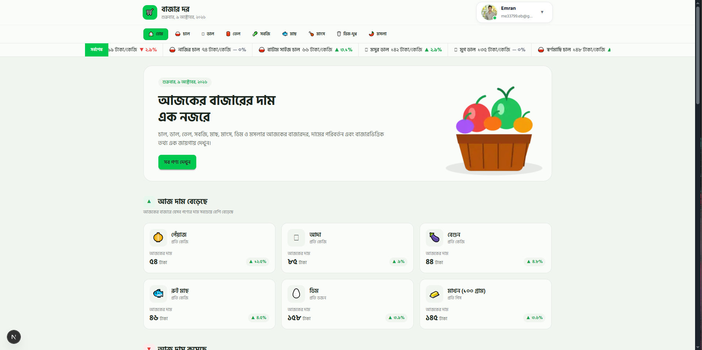

# Bazar Dor — বাজার দর

বাজার দর একটি Bengali-first market price web app, যেখানে প্রয়োজনীয় পণ্যের
আজকের দাম, দাম বৃদ্ধি/হ্রাস এবং বাজারভিত্তিক মূল্য সহজে দেখা যায়।

## Technologies

- Next.js
- React
- TypeScript
- Tailwind CSS
- DaisyUI
- Better Auth
- MongoDB
- React Hot Toast
- Lucide React

## Features

- 🛒 প্রয়োজনীয় পণ্যের আজকের বাজারদর দেখা
- 📈 আজ দাম বেড়েছে এমন পণ্য দেখা
- 📉 আজ দাম কমেছে এমন পণ্য দেখা
- 🔎 পণ্য সার্চ ও price sorting
- 🏷️ Category অনুযায়ী পণ্য দেখা
- 📊 পণ্যের বিস্তারিত price history ও বাজারভিত্তিক দাম দেখা
- 🔐 Email/Password authentication
- 🌐 Google ও GitHub social login
- 👤 Profile information update
- 📱 Mobile, tablet ও desktop responsive design
- 🔔 Success ও error toast notification
- ⚡ Loading skeleton এবং friendly 404 page

## API

এই project-এ Bazar Dor API ব্যবহার করা হয়েছে:

`https://api.api-store.workers.dev/api/bazardor`

## Screenshot



## Getting Started

প্রথমে dependencies install করো:

```bash
npm install
